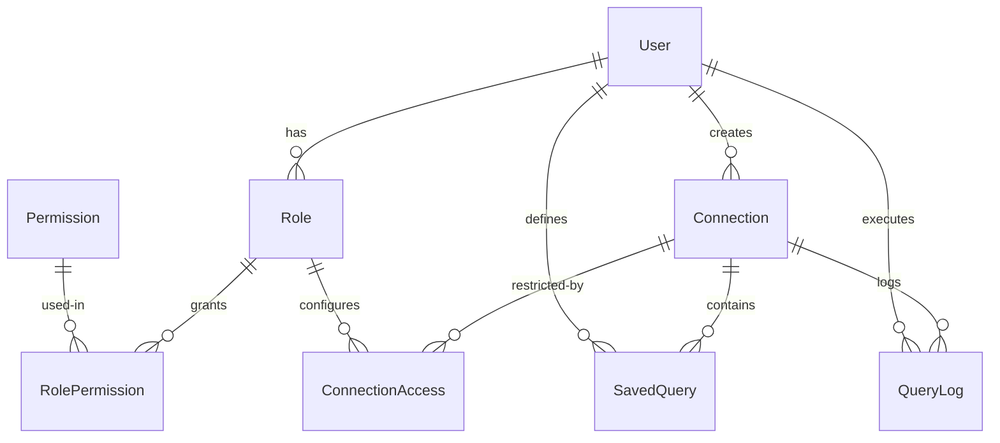

# rexadb-studio

Backend for the rexadb database client GUI. Proxies database connections through a central API with RBAC, so admins can grant team members limited access to databases without exposing credentials.

---

## Quick Start

### Local

```sh
cp .env.example .env        # configure ENCRYPTION_KEY, SUPABASE_URL, SUPABASE_SERVICE_KEY
npm install
npx drizzle-kit migrate     # create SQLite tables
npx tsx src/db/seed.ts      # seed default roles + permissions
npm run dev                 # http://localhost:3000
```

### Docker

```sh
# Set environment variables in a .env file or export them
export ENCRYPTION_KEY="<64-char-hex>"
export SUPABASE_URL="https://your-project.supabase.co"
export SUPABASE_SERVICE_KEY="your-service-role-key"

# Build and start
docker compose up -d        # http://localhost:3000

# Or build manually
docker build -t rexadb-studio .
docker run -d -p 3000:3000 \
  -e DATABASE_URL="file:/app/data/rexadb.db" \
  -e ENCRYPTION_KEY="$ENCRYPTION_KEY" \
  -e SUPABASE_URL="$SUPABASE_URL" \
  -e SUPABASE_SERVICE_KEY="$SUPABASE_SERVICE_KEY" \
  -v rexadb-data:/app/data \
  rexadb-studio
```

Migrations and seed data are applied automatically on container startup.

---

## Architecture

```
Client App          rexadb-studio Backend          Target Database
     │                     │                             │
     │  POST /query        │                             │
     │ ──────────────────► │  ┌──────────────────┐       │
     │   Bearer <token>    │  │  1. Verify token  │       │
     │   { sql: "..." }    │  │  2. Check RBAC    │       │
     │                     │  │  3. Decrypt creds │       │
     │                     │  │  4. Connect via   │──────►│  SELECT ...
     │                     │  │     driver        │       │
     │                     │  │  5. Execute query │◄──────│  rows
     │  { rows, fields }   │  │  6. Log audit     │       │
     │ ◄───────────────────│  └──────────────────┘       │
     │                     │                             │
```

### Layer Overview

```
src/app/api/           Thin route handlers — parse request, delegate, return response
src/config/            Permission codes and default role definitions
src/db/                Drizzle schema, client singleton, seed logic
src/lib/auth.ts        Auth adapter (Supabase) — swap this file to change provider
src/lib/rbac.ts        Permission and connection-level access checks
src/lib/encryption.ts  AES-256-GCM — encrypts stored connection passwords
src/lib/drivers/       Database driver interface + registry + implementations
src/types/             Shared TypeScript interfaces
```

---

## Data Model (SQLite)



| Table | Purpose | Key Columns |
|-------|---------|-------------|
| `users` | Registered users synced from auth provider | id, email, roleId, isActive |
| `roles` | Named roles with permission sets | name, isSystem |
| `permissions` | All available permission codes | code |
| `role_permissions` | Many-to-many join | roleId, permissionId |
| `connections` | Saved database connection metadata | type, host, port, encryptedPassword |
| `connection_access` | Role-based access rules per connection | accessType, queryPattern |
| `saved_queries` | Predefined query templates | name, queryText |
| `query_logs` | Audit trail of executed queries | query, userId, duration |

---

## API Endpoints

### Auth

```
POST /api/auth/verify
  Authorization: Bearer <supabase-token>
  → { user: { id, email, roleId, isActive } }
```
Verifies the Supabase JWT. If the user doesn't exist locally, upserts them with the `viewer` role.

### Permissions

```
GET /api/permissions
  → { data: [{ id, code, name, description }] }
```
Lists all available permission codes. Requires `permissions.view`.

### Roles

```
GET /api/roles
  → { data: [{ id, name, description, isSystem, permissions[], userCount }] }

POST /api/roles
  { name, description?, permissionIds: number[] }
  → { data: { id, name, description } }

GET /api/roles/:id
  → { data: { id, name, permissions[], users[] } }

PUT /api/roles/:id
  { name?, description?, permissionIds?: number[] }
  → { data: { id, name, permissions[] } }

DELETE /api/roles/:id
  → { data: { success: true } }
  (fails with 403 if role isSystem)
```

Custom roles can be created at runtime. System roles (`super_admin`, `admin`, `developer`, `viewer`) cannot be deleted.

### Connections

```
GET /api/connections
  → { data: [{ id, name, type, host, port, ... }] }
  (password never returned)

POST /api/connections
  { name, type: "postgres"|"mysql", host, port, database, username, password, ssl? }
  → { data: { id, name, ... } }

GET /api/connections/:id
  → { data: { id, name, type, host, port, ... } }

PUT /api/connections/:id
  { name?, host?, port?, database?, username?, password?, ssl? }
  → { data: { id, name, ... } }

DELETE /api/connections/:id
  → { data: { success: true } }
```

Passwords are encrypted with AES-256-GCM before storage and never returned in responses.

### Connection Access

```
GET /api/connections/:id/access
  → { data: [{ id, roleId, role: { name }, accessType, queryPattern }] }

PUT /api/connections/:id/access
  { roleId, accessType: "FULL_ACCESS"|"READ_ONLY"|"CUSTOM", queryPattern?, allowedQueryIds? }
  → { data: { connectionId, roleId, accessType } }
```

Controls which roles can access which connections and at what level. Requires `connections.manage_access`.

### Query Execution

```
POST /api/connections/:id/query
  { sql: string, params?: unknown[] }
  → { data: { rows, fields, rowCount, duration } }
```

The core proxy endpoint. Verifies:
1. User has `queries.execute` or `queries.readonly` permission
2. User's role has access to this connection
3. Access type allows the query (READ_ONLY blocks writes, CUSTOM checks pattern/saved queries)

The query is logged to `query_logs` for audit.

### Saved Queries

```
GET /api/connections/:id/saved-queries
  → { data: [{ id, name, queryText }] }

POST /api/connections/:id/saved-queries
  { name, queryText }
  → { data: { id, name, queryText } }

PUT /api/connections/:id/saved-queries/:sqId
  { name?, queryText? }
  → { data: { id, name, queryText } }

DELETE /api/connections/:id/saved-queries/:sqId
  → { data: { success: true } }
```

Predefined query templates that can be referenced by `connection_access` for granular control.

---

## Permission System

### Built-in Permissions

Code | Label | Description
-----|-------|------------
`connections.create` | Create Connections | Create new database connections
`connections.read` | Read Connections | View connection metadata
`connections.update` | Update Connections | Edit connection configuration
`connections.delete` | Delete Connections | Remove connections
`connections.manage_access` | Manage Access | Grant/revoke access to connections
`queries.execute` | Execute Queries | Run arbitrary SQL
`queries.readonly` | Read-Only Queries | Run SELECT-only queries
`queries.saved` | Saved Queries | Run predefined saved queries
`users.manage` | Manage Users | Invite/update/remove users
`users.read` | Read Users | View user list
`roles.manage` | Manage Roles | Create/edit/delete custom roles
`roles.assign` | Assign Roles | Change user role assignments
`permissions.view` | View Permissions | List available permissions
`query_logs.view` | View Query Logs | View query audit trail

### Default Roles

| Role | System | Permissions |
|------|--------|-------------|
| `super_admin` | Yes | All |
| `admin` | Yes | All except `connections.delete`, `roles.manage` |
| `developer` | Yes | `connections.*`, `queries.*`, `permissions.view` |
| `viewer` | Yes | `connections.read`, `queries.readonly`, `permissions.view` |

### Connection-Level Access Types

When a role is granted access to a connection, one of three access types applies:

| Access Type | Behavior |
|-------------|----------|
| `FULL_ACCESS` | Any SQL is allowed |
| `READ_ONLY` | Only `SELECT`, `WITH`, `EXPLAIN`, `DESCRIBE`, `SHOW` queries allowed |
| `CUSTOM` | Check against `queryPattern` regex OR `allowedQueryIds` (saved queries). If either matches, the query runs. |

Roles with `connections.manage_access` permission bypass per-connection access checks entirely.

---

## Connection-Level Permission Flow

```
POST /api/connections/:id/query
  │
  ├── Authenticate user (Supabase JWT)
  │
  ├── Does user's role have 'queries.execute' OR 'queries.readonly'?
  │   NO  → 403
  │
  ├── Does user's role have 'connections.manage_access'?
  │   YES → FULL_ACCESS (skip per-connection check)
  │
  ├── Fetch connection_access for this role + connection
  │   NONE → 403
  │
  ├── Check accessType:
  │   FULL_ACCESS  →   ✓ allow
  │   READ_ONLY    →   query must start with SELECT/WITH/EXPLAIN/DESCRIBE/SHOW
  │                    ✓ allow | ✗ deny
  │   CUSTOM       →   test queryPattern regex OR
  │                    check allowedQueryIds against saved_queries
  │                    ✓ allow | ✗ deny
  │
  ├── Decrypt password, create driver, execute query
  │
  └── Log to query_logs, return results
```

---

## Extending

### Adding a New Database Type

1. Create `src/lib/drivers/<name>.ts`
2. Implement the `DatabaseDriver` interface:

```typescript
import { registerDriver } from './index';
import type { DatabaseDriver, ConnectionConfig, QueryResult } from './index';

class MyDriver implements DatabaseDriver {
  constructor(config: ConnectionConfig) { /* ... */ }
  async connect(): Promise<void> { /* ... */ }
  async disconnect(): Promise<void> { /* ... */ }
  async query(sql: string, params?: unknown[]): Promise<QueryResult> { /* ... */ }
  async testConnection(): Promise<boolean> { /* ... */ }
}

registerDriver('<name>', MyDriver);
```

### Adding a New Permission

Add an entry to `src/config/permissions.ts`:

```typescript
{ code: 'analytics.view', name: 'View Analytics', description: 'Access analytics dashboard' }
```

The seed script will automatically insert it on next run. Then assign it to roles via `PUT /api/roles/:id`.

### Swapping Auth Provider

Rewrite `src/lib/auth.ts`:

```typescript
import { NextRequest } from 'next/server';
import { AppError } from './errors';

export interface AuthAdapter {
  verifyToken(token: string): Promise<{ sub: string; email: string } | null>;
}

// Replace this class with your provider's implementation
class YourAuthAdapter implements AuthAdapter { /* ... */ }

export const authAdapter: AuthAdapter = new YourAuthAdapter(/* config */);
```

The rest of the codebase only calls `authAdapter.verifyToken(token)` — nothing else imports Supabase.

### Adding a Custom Role at Runtime

```sh
curl -X POST /api/roles \
  -H "Authorization: Bearer <token>" \
  -d '{
    "name": "analyst",
    "description": "Can run analytics queries",
    "permissionIds": [1, 2, 3]
  }'
```

Then grant it connection access via `PUT /api/connections/:id/access`.

---

## Error Responses

All errors return a consistent shape:

```json
{ "error": "Description of what went wrong", "code": "ERROR_CODE" }
```

| Status | Meaning |
|--------|---------|
| 401 | Missing or invalid auth token |
| 403 | Missing required permission or access denied |
| 404 | Resource not found |
| 409 | Conflict (e.g. duplicate role name) |
| 422 | Validation error (Zod schema) |
| 500 | Internal error (logged to console) |

---

## Dependencies

| Package | Role |
|---------|------|
| next, react, react-dom | HTTP server and routing |
| drizzle-orm, @libsql/client | SQLite ORM and driver |
| @supabase/supabase-js | Auth token verification |
| pg | Postgres driver (target DB) |
| mysql2 | MySQL driver (target DB) |
| zod | Request body validation |
| drizzle-kit, tsx | Migration tooling and script runner |
