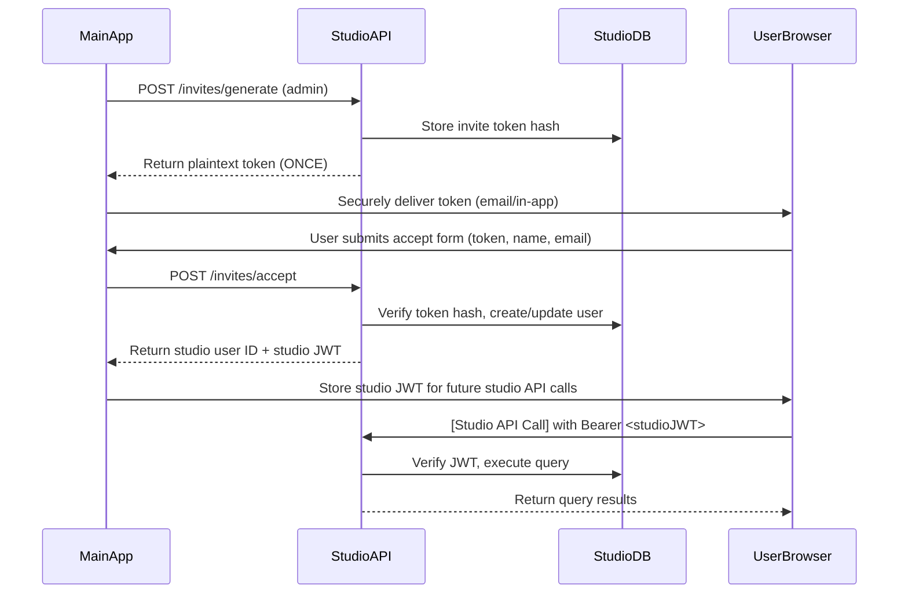

# Integrating Your Main App with rexadb-studio

This document explains how to integrate your main application (which uses Supabase for authentication) with the rexadb-studio backend using the invite-based authentication system.

## Overview

The rexadb-studio backend uses an invite-based system to onboard users from your main application. This ensures:
- **Isolation**: The studio backend never needs access to your main app's Supabase configuration or user database.
- **Consent**: Users must explicitly accept an invitation to join the studio.
- **Audit Trail**: All invitation actions are logged in the studio's SQLite database.
- **Minimal Data Exchange**: Only essential user information (name, email) is shared at onboarding.

## Authentication Flow



## Step-by-Step Implementation

### 1. Studio Admin Generates an Invite

The studio admin (logged into the studio UI) generates an invite for a user from your main app.

**API Call** (made by studio admin via studio UI or your main app if you expose this endpoint):
```http
POST /api/invites/generate
Authorization: Bearer <studio-admin-session-token>
Content-Type: application/json

{
  "email": "user@example.com",
  "roleId": 2  // Optional: defaults to viewer (roleId=1) if not specified
}
```

**Success Response** (HTTP 201):
```json
{
  "data": {
    "id": "123",
    "email": "user@example.com",
    "token": "plaintext_32_byte_hex_token_shown_only_once",
    "expiresAt": "2026-05-27T10:00:00.000Z"
  }
}
```

> **Important**: The plaintext token is only returned once. The studio admin must immediately and securely transmit it to the user.

#### 1a. Optional: Expose Invite Generation in Your Main App
If you want studio admins (who are also users in your main app) to generate invites from within your main app:
1. Add a button/link in your studio admin UI that opens a modal/form.
2. When submitted, your main app makes a proxy request to your own backend.
3. Your backend (which has the studio JWT for the admin) forwards the request to `POST /studio-api/invites/generate`.
4. Your backend receives the plaintext token and displays it to the admin (e.g., in a modal) to copy/share.

### 2. Securely Deliver the Token to the User

The studio admin must share the plaintext token with the intended user via a secure channel. Recommended methods:
- **Email**: Send the token via your main app's email system (ensure email is encrypted in transit).
- **In-app Notification**: If the user is logged into your main app, show the token in a secure modal (with warning not to screenshot/share).
- **SMS**: For high-security scenarios.

**Never**:
- Send the token in an unencrypted channel (e.g., Slack, unencrypted email).
- Log the token anywhere.
- Allow the token to be visible in browser dev tools (use `autocomplete="off"` and avoid storing in state if possible).

### 3. User Accepts the Invite (Via Your Main App)

When the user receives the token, they use your main app to accept the invite.

**API Call** (made by your main app on behalf of the user):
```http
POST /api/invites/accept
Content-Type: application/json

{
  "token": "plaintext_32_byte_hex_token_from_admin",
  "name": "John Doe",
  "email": "user@example.com"
}
```

> **Note**: This endpoint is **public** (no authentication required) because it validates the invite token itself.

**Success Response** (HTTP 200):
```json
{
  "data": {
    "userId": "uuid-string-from-studio",
    "studioToken": "jwt-for-studio-api-calls"
  }
}
```

#### 3a. Implementation in Your Main App
When the user submits the accept form:
```javascript
// Example using fetch (adjust for your framework)
async function acceptStudioInvite(token, name, email) {
  const response = await fetch('https://your-studio-domain.com/api/invites/accept', {
    method: 'POST',
    headers: {
      'Content-Type': 'application/json'
    },
    body: JSON.stringify({ token, name, email })
  });

  if (!response.ok) {
    const error = await response.json();
    throw new Error(error.error || 'Failed to accept invite');
  }

  return response.json();
}

// After successful acceptance:
// 1. Store the studioToken securely (e.g., in httpOnly cookie or encrypted local storage)
// 2. Store the userId for future reference
// 3. Redirect user to studio interface or show success message
```

### 4. Making Studio API Calls on Behalf of the User

Once the user has accepted the invite and you have their studio JWT, all subsequent studio API calls must include this token.

**Example Studio API Call** (e.g., to run a query):
```http
POST /api/connections/1/query
Authorization: Bearer <studio-jwt-from-accept>
Content-Type: application/json

{
  "sql": "SELECT * FROM users LIMIT 10"
}
```

**Response**:
```json
{
  "data": {
    "rows": [...],
    "fields": [...],
    "rowCount": 50,
    "duration": 12
  }
}
```

#### 4a. Implementation in Your Main App
When making studio API calls:
```javascript
async function studioApiCall(endpoint, method, data = {}) {
  const studioToken = getStoredStudioToken(); // Retrieve from secure storage
  
  const response = await fetch(`https://your-studio-domain.com${endpoint}`, {
    method,
    headers: {
      'Authorization': `Bearer ${studioToken}`,
      'Content-Type': 'application/json'
    },
    body: JSON.stringify(data)
  });

  if (!response.ok) {
    const error = await response.json();
    throw new Error(error.error || 'Studio API error');
  }

  return response.json();
}

// Usage:
const queryResult = await studioApiCall(
  '/api/connections/1/query',
  'POST',
  { sql: 'SELECT 1' }
);
```

## Security Best Practices

### For Your Main App
1. **Token Handling**:
   - Never log the plaintext invite token.
   - Never store the plaintext token longer than necessary (zero memory after sending to accept endpoint).
   - Use secure contexts (HTTPS only) for all token transmissions.

2. **User Data**:
   - Only share the user's name and email at accept time (no additional PII).
   - Allow users to review/edit name/email before submission (optional but recommended).

3. **Session Management**:
   - After accepting an invite, consider requiring re-authentication for sensitive studio actions.
   - Implement studio token refresh if needed (studio tokens expire in 30 days by default).

### Studio-Side Protections (Already Implemented)
- Invite tokens are 32-byte cryptographically random values (256 bits of entropy).
- Tokens are hashed with bcrypt (cost=10) before storage.
- Invites expire after 7 days (configurable in code).
- Each token can only be used once (marked as `ACCEPTED` after use).
- Email verification: Studio only accepts the exact email provided during accept.
- Role assignment: Invites can specify a role (defaults to viewer).

## Error Handling

Common errors your main app should handle:

| Error Scenario | HTTP Status | Message | Action |
|----------------|-------------|---------|--------|
| Invite token invalid/expired | 400 | `Invalid or expired token` | Show error, allow user to request new invite |
| Email mismatch | 400 | `Email does not match invitation` | Confirm user entered correct email |
| Missing fields | 400 | `Token, name, and email are required` | Validate form before submission |
| Studio admin lacks permission | 403 | `Missing required permission: ...` | Check admin's studio role |
| Rate limiting (if implemented) | 429 | `Too many requests` | Implement retry with backoff |
| Studio server down | 5xx | `Internal server error` | Show generic error, retry later |

## Data Flow Summary

1. **Invite Creation**:
   - Studio admin → Studio API: `POST /invites/generate` → Returns plaintext token (once)
   - Admin → Secure Channel → User: Shares token

2. **Invite Acceptance**:
   - User (via Main App) → Studio API: `POST /invites/accept` → Returns `{ userId, studioToken }`
   - Main App → Secure Storage: Stores `studioToken` and `userId`

3. **Studio API Usage**:
   - User's Browser → Studio API: `[Any Endpoint]` with `Authorization: Bearer <studioToken>`
   - Studio API → Studio DB: Validates token, checks RBAC, executes query/logs audit
   - Studio API → User's Browser: Returns response

## Testing the Integration

### In Development
1. Start studio backend: `npm run dev`
2. Set environment variables:
   ```bash
   ENCRYPTION_KEY="aaaaaaaaaaaaaaaaaaaaaaaaaaaaaaaaaaaaaaaaaaaaaaaaaaaaaaaaaaaaaaaa"
   STUDIO_JWT_SECRET="bbbbbbbbbbbbbbbbbbbbbbbbbbbbbbbb"
   ```
3. Test invite flow:
   - Generate invite: `POST /api/invites/generate` (as studio admin)
   - Accept invite: `POST /api/invites/accept` (with token, name, email)
   - Make studio API call: `POST /api/connections/1/query` (with studio token)

### In Production
- Use strong, randomly generated secrets for `ENCRYPTION_KEY` and `STUDIO_JWT_SECRET`.
- Enable HTTPS everywhere.
- Monitor logs for invite acceptance and studio API usage.
- Consider adding rate limiting to `/invites/accept` endpoint.

## Troubleshooting

| Symptom | Likely Cause | Solution |
|---------|--------------|----------|
| `Invalid or expired token` on accept | Token too old (>7 days) or wrong | Generate new invite |
| `Email does not match invitation` | User entered different email | Confirm email matches invite exactly |
| `Missing required permission: ...` | Studio user lacks role permission | Grant appropriate role in invite or update user role |
| Studio API calls return 401 | Missing/expired studio token | Refresh by re-accepting invite or re-login |

## Further Customization

### Changing Invite Expiration
Edit `src/app/api/invites/route.ts`:
```typescript
// Change 7 days to desired duration
const expiresAt = new Date(Date.now() + 7 * 24 * 60 * 60 * 1000).toISOString();
```

### Changing Studio Token Expiration
Edit `src/lib/auth.ts`:
```typescript
// Change 30 days to desired duration (in seconds)
const options = { expiresIn: 30 * 24 * 60 * 60 }; // 30 days
```

### Adding Additional User Fields at Accept
1. Modify `AcceptInviteBody` interface in `src/app/api/invites/accept/route.ts`
2. Update SQL insert in same file to include new fields
3. Update `users` table in `src/db/schema.ts` to add new columns
4. Update `src/db/seed.ts` if needed for default values

---
This integration pattern ensures your main app retains full control over user authentication and identity, while the studio backend remains a secure, auditable proxy for database access with fine-grained permissions.